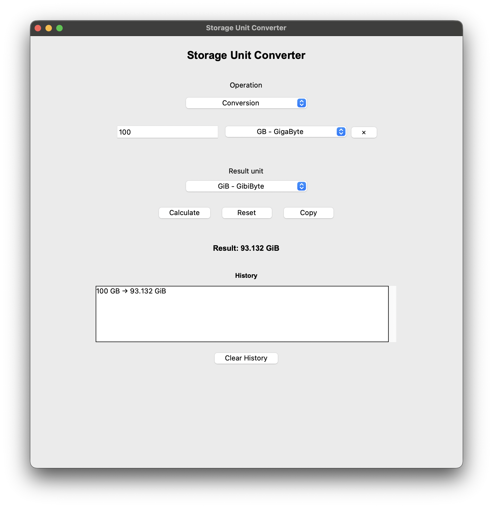

# Storage Unit Converter

[](https://github.com/Aid3lito/storage-unit-converter/releases/latest)
[](https://github.com/Aid3lito/storage-unit-converter/actions/workflows/tests.yml)

A lightweight storage unit converter for desktop and command-line use.

Built with Python and Tkinter, Storage Unit Converter provides both a graphical interface and a command-line interface for converting, adding, and subtracting decimal and binary storage values.

## Features

- Convert between decimal and binary storage units
- Add multiple storage values using different units
- Subtract multiple storage values using different units
- Dynamically add or remove input fields
- Choose the desired output unit
- Automatic formatting of large and small numbers
- Scientific notation for very small values
- Calculation history
- Copy results to the clipboard
- Reset the interface instantly
- Keyboard support with the Enter key
- No external runtime dependencies for pre-built desktop releases

## Supported Platforms

Storage Unit Converter supports:

- macOS Intel (`x86_64`)
- macOS Apple Silicon (`arm64`)
- Windows 64-bit (`x86_64`)
- Linux 64-bit (`x86_64`)

## Supported Units

### Decimal units

- Byte (B)
- Kilobyte (KB)
- Megabyte (MB)
- Gigabyte (GB)
- Terabyte (TB)
- Petabyte (PB)
- Exabyte (EB)

### Binary units

- Byte (B)
- Kibibyte (KiB)
- Mebibyte (MiB)
- Gibibyte (GiB)
- Tebibyte (TiB)
- Pebibyte (PiB)
- Exbibyte (EiB)

## Screenshot



## Requirements for Source Installation

- Python 3.9 or later
- Tkinter

Tkinter is included with most standard Python installations.
On some Linux distributions, it may need to be installed separately.

## Installation

### Desktop Application

Pre-built graphical desktop applications are available through GitHub Releases for:

- macOS Intel (`x86_64`)
- macOS Apple Silicon (`arm64`)
- Windows 64-bit (`x86_64`)
- Linux 64-bit (`x86_64`)

These pre-built archives provide the graphical desktop application.

### Command-Line Interface

The command-line interface is currently installed separately from the source repository.

For end users, `pipx` is recommended:

```bash
git clone https://github.com/Aid3lito/storage-unit-converter.git
cd storage-unit-converter
pipx install .
```
After installation, the following commands are available:

```bash
suc --help
```

or:

```bash
storage-unit-converter --help
```

Example:

```bash
suc convert 100 GB GiB
```

Output:

```bash
93.13225746 GiB
```

On Linux distributions using externally managed Python environments, such as Kali Linux, `pipx` avoids modifying the system Python installation.

## Usage

### Desktop Application

If you downloaded a pre-built release, launch the graphical application directly from the extracted archive.

When running from source:

```bash
python3 -m storage_converter.app
```

For command-line usage, see the [Command-Line Interface](#command-line-interface) section below.

### Conversion

1. Select **Conversion**.
2. Enter a value.
3. Select the source unit.
4. Select the desired result unit.
5. Click **Calculate**.

### Addition and Subtraction

1. Select **Addition** or **Subtraction**.
2. Enter at least two values.
3. Select a unit for each value.
4. Add additional input fields if necessary.
5. Select the desired result unit.
6. Click **Calculate**.

## Project Structure

```text
storage-unit-converter/
├── .github/
│   └── workflows/
│       ├── build.yml
│       └── tests.yml
├── assets/
│   ├── icons/
│   │   ├── app-icon.png
│   │   ├── app-icon.icns
│   │   └── app-icon.ico
│   └── screenshots/
│       └── storage-unit-converter.png
├── packaging/
│   └── launcher.py
├── src/
│   └── storage_converter/
│       ├── __init__.py
│       ├── app.py
│       ├── cli.py
│       ├── converter.py
│       ├── units_binary.json
│       └── units_decimal.json
├── tests/
│   ├── test_cli.py
│   └── test_converter.py
├── .gitattributes
├── .gitignore
├── CHANGELOG.md
├── CONTRIBUTING.md
├── LICENSE
├── README.md
├── SECURITY.md
├── pyproject.toml
├── storage-unit-converter-linux.spec
├── storage-unit-converter-macos.spec
└── storage-unit-converter-windows.spec
```

## Command-Line Interface

Storage Unit Converter also provides a command-line interface.

The full command is:

```bash
storage-unit-converter
```
A shorter command is also available:

```bash
suc
```
### Convert

```bash
suc convert 100 GB GiB
```
Example output:

```bash
93.13225746 GiB
```
### Addition and Subtraction

```bash
suc add 1 GB 500 MB --to GB
suc subtract 2 GB 500 MB --to GB
```

Example output:

```bash
1.5 GB
1.5 GB
```

### Help

```bash
suc --help
```

## Development

For development, use a virtual environment.

macOS / Linux

```bash
git clone https://github.com/Aid3lito/storage-unit-converter.git
cd storage-unit-converter
python3 -m venv .venv
source .venv/bin/activate
python3 -m pip install -e .
```

Windows PowerShell

```bash
git clone https://github.com/Aid3lito/storage-unit-converter.git
cd storage-unit-converter
python -m venv .venv
.venv\Scripts\Activate.ps1
python -m pip install -e .
```

## Releases

Pre-built graphical desktop applications are available through GitHub Releases for:

- macOS Intel (`x86_64`)
- macOS Apple Silicon (`arm64`)
- Windows 64-bit (`x86_64`)
- Linux 64-bit (`x86_64`)

The downloadable release archives contain the graphical desktop application only. The command-line interface is installed separately from the source repository.

## Contributing

Contributions are welcome.

Please read [CONTRIBUTING.md](CONTRIBUTING.md) before submitting an issue or pull request.

## Security

Please refer to [SECURITY.md](SECURITY.md) for information about reporting security issues.

## License

See the [LICENSE](LICENSE) file for licensing information.